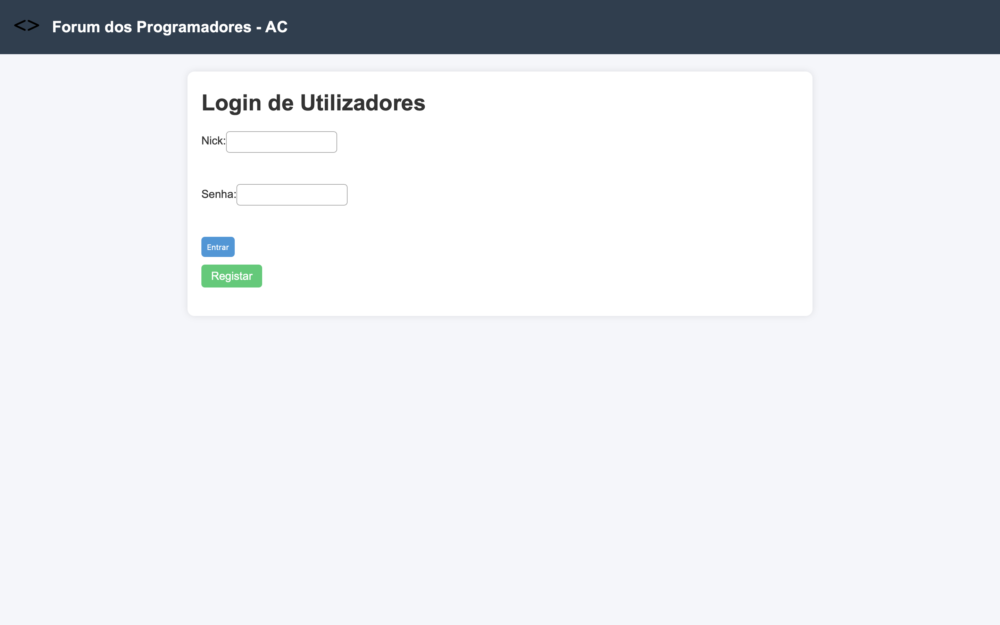
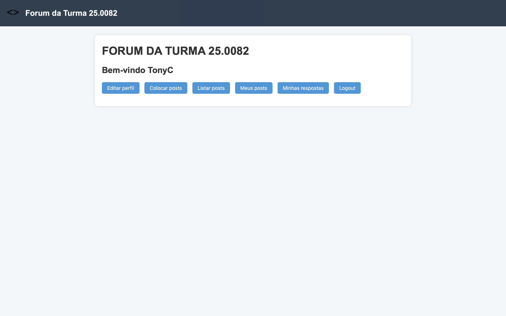
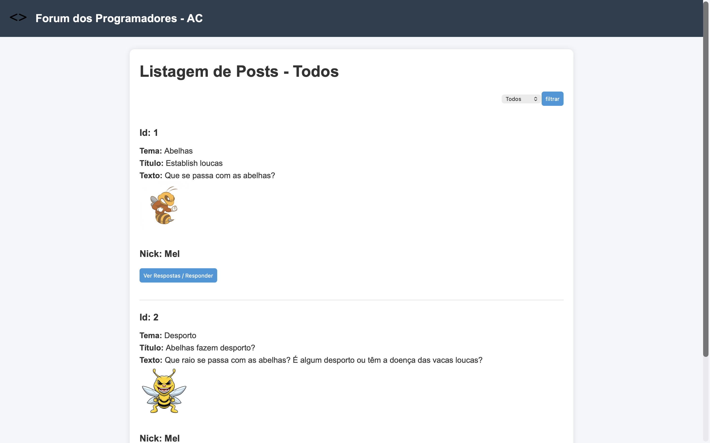
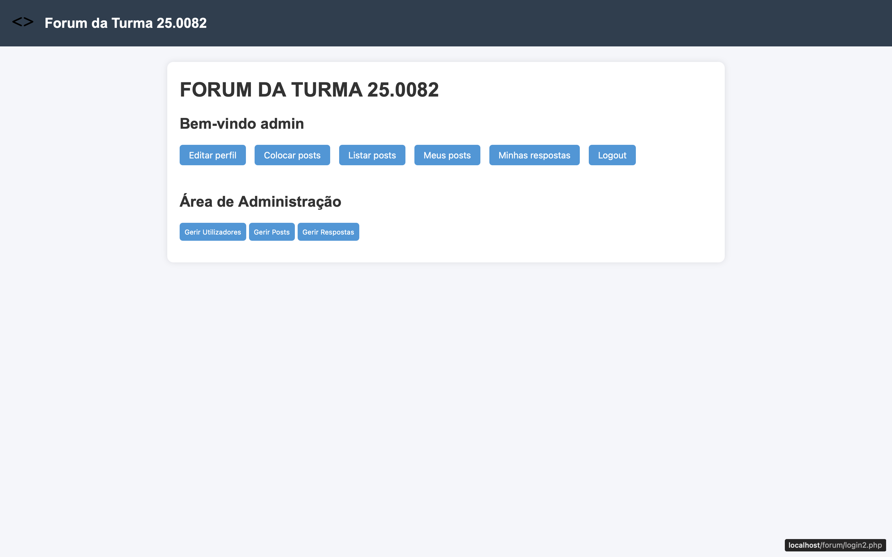
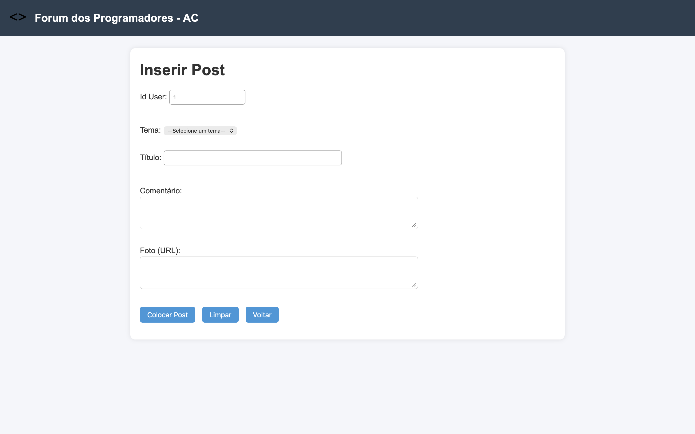

# PHP MySQL Forum Platform

A full-featured forum application with user authentication, post management, and administrative controls. Built as part of IEFP Level 4 Programming Certification.


## 🌐 Live Demo

**[View Live Application](http://alienmem.42web.io)** ← Click to see it in action!

*Portuguese language interface. Demo hosted on 42web.io (InfinityFree).*

---

## 🎯 Overview

A complete forum system allowing users to create accounts, post messages, reply to discussions, and manage their content. Includes a full administrative interface for user and content moderation.

**Project Type:** Full-stack web application  
**Duration:** 6-week module (IEFP Course 3933)  
**Status:** Completed ✓

## ✨ Features

### User Features
- ✅ **User Registration & Authentication**
  - Session-based login system
  - Profile editing capabilities

- ✅ **Post Management**
  - Create new forum posts with categories
  - View all posts by category
  - Reply to existing posts
  - Edit and soft-delete own posts
  - Recover deleted posts

- ✅ **Personal Dashboard**
  - View "My Posts" 
  - View "My Replies"
  - Track posting activity
  - Edit profile information

### Administrative Features
- ✅ **User Management**
  - View all registered users
  - Block/unblock user accounts
  - Edit user information
  - Search users by multiple parameters

- ✅ **Content Moderation**
  - Manage all forum posts
  - Manage all replies
  - Soft-delete inappropriate content
  - Recover deleted content
  - Filter posts by category/theme

- ✅ **System Security**
  - Session validation on all protected pages
  - Access control (user vs admin permissions)
  - Error handling for unauthorized access

## 🗄️ Database Architecture

### Tables Structure

**t_user** (Users table)
```sql
- id (INT, PRIMARY KEY, AUTO_INCREMENT)
- nick (VARCHAR(20), UNIQUE, NOT NULL)
- nome (VARCHAR(100), NOT NULL) 
- email (VARCHAR(50), NOT NULL)
- data_nasc (VARCHAR(10), NOT NULL)
- pass (VARCHAR(20), NOT NULL)
- foto (VARCHAR(300), NOT NULL)
- apagado (INT, DEFAULT 0) -- Soft delete flag
```

**t_post** (Posts table)
```sql
- id (INT, PRIMARY KEY, AUTO_INCREMENT)
- tema (VARCHAR(50), NOT NULL) -- Category/theme
- titulo (VARCHAR(100), NOT NULL)
- conteudo (TEXT, NOT NULL)
- data (DATETIME, NOT NULL)
- id_user (INT, FOREIGN KEY -> t_user)
- apagado (INT, DEFAULT 0)
```

**t_resp** (Replies table)
```sql
- id (INT, PRIMARY KEY, AUTO_INCREMENT)
- resposta (TEXT, NOT NULL)
- data (DATETIME, NOT NULL)
- id_post (INT, FOREIGN KEY -> t_post)
- id_user (INT, FOREIGN KEY -> t_user)
- apagado (INT, DEFAULT 0)
```

**t_tema** (Categories/Themes table)
```sql
- id (INT, PRIMARY KEY, AUTO_INCREMENT)
- nome (VARCHAR(50), NOT NULL)
```

### Design Decisions

**Soft Delete Pattern**: Instead of permanently deleting records, the `apagado` flag marks content as deleted while preserving data integrity and allowing recovery.

**Session Management**: PHP sessions store user ID and admin status, validated on every protected page via `valida.php` include.

**Modular Code Structure**: Repeated functionality (DB connection, session validation, filters) extracted into separate PHP includes for maintainability.

## 🛠️ Tech Stack

**Backend:**
- PHP (native, no framework)
- MySQL for data persistence

**Frontend:**
- HTML5 for structure
- CSS3 for styling (themes.css)

**Development Environment:**
- XAMPP (Apache + MySQL + PHP)
- phpMyAdmin for database management

**Deployment:**
- Can be hosted on InfinityFree or similar PHP hosting

## 📂 Project Structure
```
forum/
├── alterar_U.php           # Edit user form (admin)
├── alterar_U2.php          # User update handler (admin)
├── bloquear_U.php          # Block user account
├── desbloquear_U.php       # Unblock user account
├── eliminarP.php           # Soft-delete user's post
├── eliminarPadm.php        # Admin soft-delete post
├── eliminarR.php           # Soft-delete user's reply
├── erro.html               # General error page
├── erro_acesso.html        # Unauthorized access error
├── filtra_P.php            # Post filter/category select
├── gerir_P.php             # Manage all posts (admin)
├── gerir_R.php             # Manage all replies (admin)
├── gerir_U.php             # Manage all users
├── index.html              # Landing page
├── inserirP.php            # Create new post form
├── inserirP2.php           # Post creation handler
├── inserirR.php            # Reply to post form
├── inserirR2.php           # Reply handler
├── liga_bd.php             # Database connection include
├── listar_P.php            # List all posts (with filters)
├── login.php               # Login form
├── login2.php              # Login authentication handler
├── logout.php              # Session termination
├── meusP.php               # User's own posts
├── minhasR.php             # User's own replies
├── pesquisar_U.php         # Search users form
├── pesquisar_U2.php        # Search results handler
├── perfil.php              # Edit user profile form
├── perfil2.php             # Profile update handler
├── recuperarP.php          # Recover user's deleted post
├── recuperarR.php          # Recover user's deleted reply
├── registar.html           # Registration form
├── registo.php             # User registration handler
├── valida.php              # Session validation include
│
├── assets/
│   ├── css/
│   │   └── themes.css      # Stylesheet
│   ├── img/
│   │   └── logo.svg        # Forum logo
│   └── screenshots/
│       ├── 01-homepage.png
│       ├── 02-user-dashboard.png
│       ├── 03-post-listing.png
│       ├── 04-admin-panel.png
│       └── 05-create-post.png
│
└── README.md               # Project README with documentation & screenshots
```

## 🔒 Security Features

**Session Validation**
```php
// valida.php - included on all protected pages
session_start();
if((!isset($_SESSION['id']) == true) and (!isset($_SESSION['nick']) == true)) {
    header('location:erro_acesso.html');
}
```

**Why this approach:** Validates both user ID and nickname are set in session, ensuring complete authentication state before allowing access to protected pages.

**SQL Injection Prevention**
- Basic input validation is used on some forms

**Access Control**
- User vs admin role separation
- Protected pages redirect unauthorized users
- Session-based authentication

## 🚀 Installation & Setup

### Prerequisites
- XAMPP (or similar PHP/MySQL environment)
- Web browser
- Text editor

### Steps

1. **Clone or download the project**
```bash
git clone https://github.com/alienmem/php-mysql-forum-platform.git
```

2. **Start XAMPP**
   - Start Apache server
   - Start MySQL server

3. **Create Database**
   - Open phpMyAdmin (http://localhost/phpmyadmin)
   - Create database: `bd_forum`
   - Import SQL schema (or run the CREATE TABLE commands from Part 1)

4. **Configure Database Connection**
   - Edit `liga_bd.php`
   - Update credentials if different from defaults:
```php
   $servidor = "localhost";
   $utilizador = "root";
   $password = "";
   $bd = "bd_forum";
```

5. **Place files in htdocs**
   - Copy project folder to `C:\xampp\htdocs\forum\`

6. **Access the application**
   - Navigate to: `http://localhost/forum/`

7. **Create admin user**
   - Register a normal user
   - In phpMyAdmin, manually set `nick='admin'` for that user

## 🌐 Language Note

**Interface Language:** Portuguese (pt-PT)

This project was developed as part of a Portuguese professional training program (IEFP), so the user interface, comments, and variable names are in Portuguese.

**Key Terms Translation:**
- `registar` = register
- `utilizador` = user  
- `listar` = list
- `inserir` = insert
- `eliminar` = delete
- `apagado` = deleted
- `gerir` = manage
- `tema` = theme/category
- `resposta` = reply/response

**Why Portuguese?** This demonstrates authentic work from a real certification program. Future projects will be developed in English for international audiences.

**Code Quality:** While the interface is in Portuguese, the application architecture, database design, and programming concepts are universal and demonstrate full-stack development proficiency regardless of natural language.

## 💡 What I Learned

### Technical Skills
- **Three-Tier Architecture**: Separation of presentation (HTML), logic (PHP), and data (MySQL) layers
- **Session Management**: Implementing stateful authentication in stateless HTTP
- **CRUD Operations**: Complete Create, Read, Update, Delete functionality
- **SQL Proficiency**: Complex queries with JOINs, filtering, and sorting
- **Soft Delete Pattern**: Data preservation while marking records inactive
- **Code Modularization**: Using PHP includes to avoid repetition (DRY principle)

### Problem-Solving
- **Challenge**: Preventing users from accessing protected pages without login  
  **Solution**: Created `valida.php` include with session validation, used across all protected pages

- **Challenge**: Distinguishing user vs admin functionality  
  **Solution**: Session variable for admin status, conditional rendering of admin-only features

- **Challenge**: Allowing content deletion without data loss  
  **Solution**: Implemented soft delete with `apagado` flag (0=active, 1=deleted)

- **Challenge**: Keeping codebase maintainable as it grew  
  **Solution**: Extracted repeated code into includes (`liga_bd.php`, `valida.php`, `filtra_P.php`)

- **Challenge**: Ensuring robust session validation  
  **Solution**: Implemented dual-check validation by verifying both `$_SESSION['id']` and `$_SESSION['nick']` are set, preventing edge cases where only partial session data exists

## 📈 Future Improvements

If I were to extend this project, I would add:

- [ ] **Enhanced Security**
  - Password hashing (currently stored in plain text - educational project only!)
  - CSRF token protection
  - Rate limiting on login attempts

- [ ] **Rich Text Editor** for post formatting
- [ ] **File Upload** for user avatars and post attachments
- [ ] **Real-time Notifications** for new replies
- [ ] **Search Functionality** for posts and replies
- [ ] **Pagination** for large result sets
- [ ] **Email Verification** on registration
- [ ] **Password Reset** functionality
- [ ] **Thread Nested Replies** instead of flat replies
- [ ] **User Reputation System** (likes, badges)
- [ ] **Mobile Responsive Design**

## 📸 Screenshots

### Homepage

*Landing page with login and registration options*

### User Dashboard

*User interface after successful login*

### Post Listing

*Forum posts with category filtering*

### Admin Panel

*Administrative interface for user and content management*

### Create Post

*Interface for creating new forum posts*

## 🎓 Project Context

This project was developed as part of **Module 3933** (Database Administration for Programmers) within the **IEFP Level 4 Programmer/Informatics Certification** program in Porto, Portugal.

**Learning Objectives:**
- Implement a complete CRUD application
- Understand three-tier web architecture
- Practice SQL database design and queries
- Learn PHP session management
- Build user authentication systems
- Create role-based access control

**Instructor:** Rui Monteiro  
**Institution:** IEFP - Centro de Formação de Vila Nova de Gaia  
**Duration:** 6 weeks (Parts 1-6)  
**Completion:** November 2024

## 📝 License

MIT License - Feel free to use this project for learning purposes

## 🤝 Connect
**Built by** **Antonio Cardoso**

📧 Email: [tony101123cardoso@icloud.com](mailto:tony101123cardoso@icloud.com)  
💼 LinkedIn: [a-cardoso-pro](https://www.linkedin.com/in/a-cardoso-pro/)  
🔗 GitHub: [alienmem](https://github.com/alienmem)

---

**⚠️ Educational Note:** This project was built for learning purposes. The password storage (plain text) and some security practices are simplified for educational clarity and should NOT be used in production applications. In real-world applications, always use proper password hashing (bcrypt, Argon2) and follow OWASP security guidelines.

---

*Part of my journey from Mathematics to Software Engineering*
